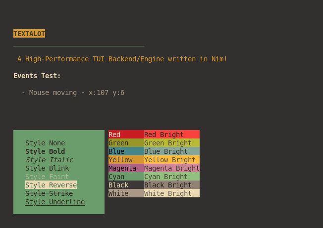

***Hey, that's a lot of text here!***

**textalot** is the no-nonsense Terminal I/O and TUI Engine, written entirely in Nim, specifically optimized for POSIX systems (Linux, macOS, etc.). It’s the muscle and mind for your terminal application, delivering high-speed, flicker-free rendering and rock-solid event handling. Minimal code, maximum performance.

## Overview
Textalot is the focused, highly efficient little engine for your TUI. While it won't hand you pre-built widgets or menus, it manages the critical terminal mechanics: handling events (keyboard, mouse, resize) instantly and ensuring flicker-free rendering using an intelligent screen buffer. It’s the simple, fast, and native foundation in Nim that allows you to focus purely on your application logic.

## Key Features
* Pure Nim, Pure POSIX: No external baggage, no massive runtime. Textalot is built 100% in Nim for native speed, a tiny footprint, and strict POSIX compliance (Linux/macOS). It just works.

* The Jitter Killer (Flicker-Free): We use an efficient internal screen buffer. This means Textalot only sends the changes to the terminal, ensuring your display is smooth, professional, and completely free of annoying flicker.

* Full ANSI Styling: Reliable support for all critical ANSI SGR codes for styling and coloring—because terminal apps deserve to look good too.

  * Styles: Bold, Faint/Dim, Italic, Underline, Blink, Reverse, and Strikethrough.

  * Colors: Full 8/16-color palette support for both foreground and background.

* Event Whisperer: No input sneaks past. Textalot accurately captures everything: Key presses, full Mouse tracking (Clicks, Dragging, Scrolling), and vital Terminal Resize events (SIGWINCH).

* Bare Metal Primitives: Offers direct drawText, drawChar, and drawRectangle functions for complete control over your application's canvas. You are the pixel master here.


## Usage / Getting Started
Integrating Textalot is as simple as it gets. Designed to be the reliable bedrock, you can drop it into your Nim project and start drawing immediately.

1. Include the File: Place the `textalot.nim` file directly into your Nim project's source directory.
2. Import: Just tell Nim where the engine is:
```nim 
import os
import textalot
 ```
 
 3. A basic textalot application loop is shown below. This foundational structure handles initialization, the continuous event/render loop, and a clean shutdown.
```nim 
import textalot, os
  

proc onExit() {.noconv.} =
    ## Function to clean up the terminal state (show cursor, restore settings) before exiting.
    deinitTextalot()
    quit(0)

# Set a hook to ensure onExit runs when Ctrl+C is pressed, preventing a corrupted terminal state.
setControlCHook(onExit)

# Initialize the Textalot TUI: enables raw mode, hides cursor, and sets up buffers.
initTextalot()

# --- Main Application Loop ---

while true:
    # Update: Reads input events (Key, Mouse, Resize) and performs differential rendering.
    updateTextalot()


    # Display the application title (Bold, White text on Yellow background).
    drawText("TEXTALOT", 2, 3, FG_COLOR_WHITE, BG_COLOR_YELLOW, STYLE_BOLD)
    
    # Draw a horizontal separator line.
    drawText("_________________________________", 2, 4, FG_COLOR_CYAN, BG_COLOR_DEFAULT)
    
    # Display the project description.
    drawText(" A High-Performance TUI Backend/Engine written in Nim!", 2, 6, FG_COLOR_YELLOW, BG_COLOR_DEFAULT)
    
    # Header for the events test area.
    drawText("Events Test:", 2, 8, FG_COLOR_WHITE, BG_COLOR_DEFAULT, STYLE_BOLD)
    
    # Draw a cyan-filled rectangle as a background for style examples (coordinates: 2,15 to 24,24).
    drawRectangle(2, 15, 24, 24, FG_COLOR_DEFAULT, BG_COLOR_CYAN) 
    
    # --- Style Examples ---
    drawText("Style None", 5, 16, FG_COLOR_DEFAULT, BG_COLOR_CYAN, STYLE_NONE)
    drawText("Style Bold", 5, 17, FG_COLOR_DEFAULT, BG_COLOR_CYAN, STYLE_BOLD)
    drawText("Style Italic", 5, 18, FG_COLOR_DEFAULT, BG_COLOR_CYAN, STYLE_ITALIC)
    drawText("Style Blink", 5, 19, FG_COLOR_DEFAULT, BG_COLOR_CYAN, STYLE_BLINK)
    drawText("Style Faint", 5, 20, FG_COLOR_DEFAULT, BG_COLOR_CYAN, STYLE_FAINT)
    drawText("Style Reverse", 5, 21, FG_COLOR_DEFAULT, BG_COLOR_CYAN, STYLE_REVERSE)
    drawText("Style Strike", 5, 22, FG_COLOR_DEFAULT, BG_COLOR_CYAN, STYLE_STRIKE)
    drawText("Style Underline", 5, 23, FG_COLOR_DEFAULT, BG_COLOR_CYAN, STYLE_UNDERLINE)


    # --- Event Handling Section ---
    # Handles all events captured by the TUI engine (Mouse, Key, Resize).

    if texalotEvent of MouseEvent:
        var mouseEvent = MouseEvent(texalotEvent)
        removeArea(4, 10, 64, 10) 

        if mouseEvent.key == EVENT_MOUSE_MOVE:
            drawText("- Mouse moving - x:" & $mouseEvent.x & " y:" & $mouseEvent.y, 4, 10, FG_COLOR_WHITE, BG_COLOR_DEFAULT)
        
        elif mouseEvent.key == EVENT_MOUSE_LEFT:
            drawText("- Mouse clicked - x:" & $mouseEvent.x & " y:" & $mouseEvent.y, 4, 10, FG_COLOR_WHITE, BG_COLOR_DEFAULT)
            
            drawChar(mouseEvent.x, mouseEvent.y, '?', FG_COLOR_WHITE, BG_COLOR_MAGENTA)
            
    elif texalotEvent of KeyEvent:
        var keyEvent = KeyEvent(texalotEvent)
        removeArea(4, 11, 64, 11)
        
        # Check for exit key (ESC)
        if keyEvent.key == EVENT_KEY_ESC:
          break

        drawText("- Key pressed - key:" & $chr(keyEvent.key), 4, 11, FG_COLOR_WHITE, BG_COLOR_DEFAULT)
        
    elif texalotEvent of ResizeEvent:
        removeArea(4, 12, 64, 12)
        
        drawText("- Window Resized - w:" & $getTerminalWidth() & " h:" & $getTerminalHeight(), 4, 12, FG_COLOR_WHITE, BG_COLOR_DEFAULT)

    # Introduce a small sleep to limit the CPU usage and control the frame rate (~100 FPS)
    os.sleep(10) 
 ```

### API

We don't need a whole separate page—textalot is simple. Everything this library offers is right here.

| Function/Variable | Description |
| :---- | :---- |
| initTextalot() | **The absolute must-have.** Initializes the terminal for TUI mode (enables raw mode, hides cursor, and sets up buffers). Always call this at the start of your application. |
| deinitTextalot() | **The Terminal Savior.** Restores the terminal to its original state before exiting the application (shows the cursor, restores raw mode, and disables mouse tracking). This must be called at the end of your program to prevent a corrupted terminal session. |
| updateTexalot() | **Must be called at the beginning of every loop iteration.** This is crucial as it handles both reading input events and performing the differential screen rendering for that cycle. |
| textalotEvent | After updateTexalot() is called, this global variable holds the event that occurred during that step. You check this variable to perform event-driven logic. It can be a NoneEvent, MouseEvent, KeyEvent, or ResizeEvent. 
| drawText(text:string, x:int, y:int, fgColor:uint32, bgColor:uint32, style:uint16) | Prints a string at the given position (x, y) using the specified foreground color, background color, and style. |
| drawRectangle(x1:int, y1:int, x2:int, y2:int, fgColor:uint32, bgColor:uint32, ch:char, style:uint16) | Fills a rectangular area defined by two corners (x1, y1 to x2, y2) using a specific character and given colors/styles. Useful for drawing UI elements or clearing areas. |
| drawChar(x:int, y: int, ch: char, fg:uint32, bg: uint32, style:uint16) | Draws a single character at the specified coordinates and updates the cell's properties (color, style) in the back buffer. |
| getTerminalWidth() | Returns the current width (number of columns) of the terminal window. |
| getTerminalHeight() | Returns the current height (number of rows) of the terminal window. |
